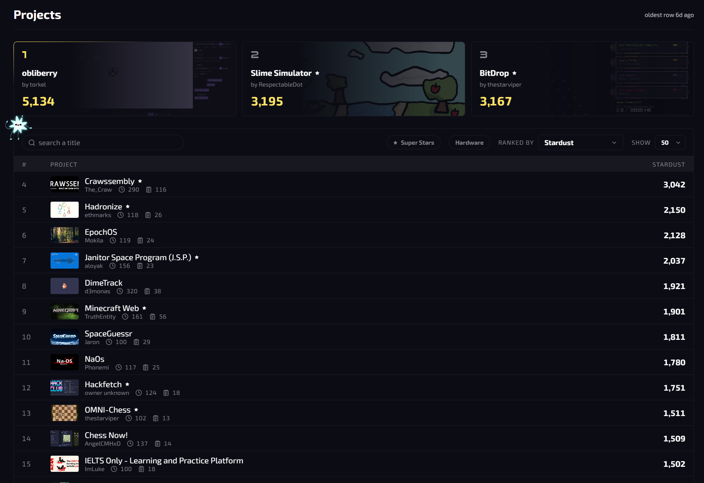
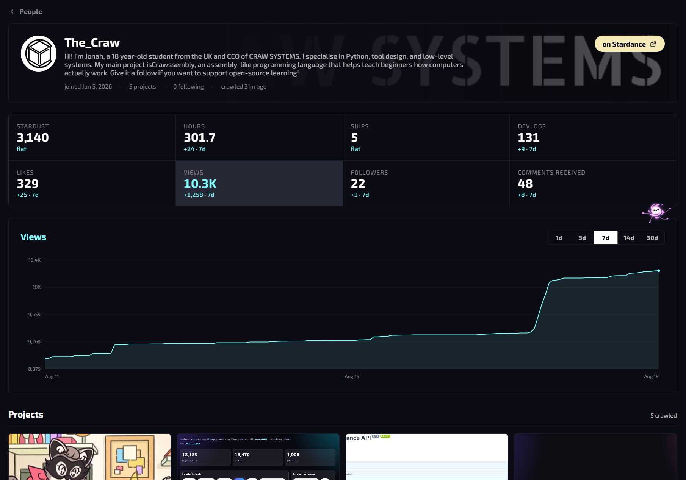
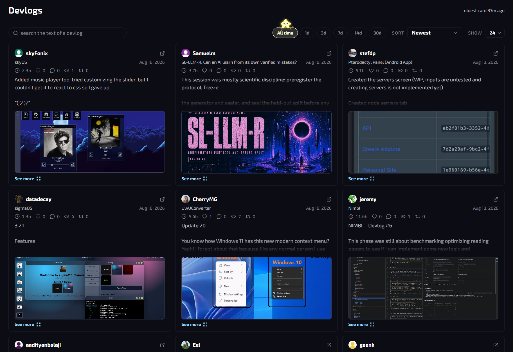

<p align="center">
  
</p>

<p align="center">
  <a href="https://stardancestats.xyz">stardancestats.xyz</a> &middot;
  <a href="https://api.stardancestats.xyz/docs">API docs</a>
</p>

# Stardance Stats

A better way to browse [Stardance](https://stardance.hackclub.com).

Stardance only shows you the current stats. SDS keeps the history behind them, and lets you sort by any of them. A crawler reads the public pages on a schedule, saves every reading, and serves it back as an open API and a site.

## Site



Every list is sortable by any stat I track, so you can rank projects by stardust,
hours, likes or views instead of scrolling the one order Stardance gives you. There
are filters for Super Stars, hardware, and search on the title.

---



Projects and people get their own page: every stat I hold, what it did over the
last 7 days, and a chart of any of them from 1 day to 30.

---



Devlogs from every project are in one feed. Search the body of them, sort by newest, longest, shortest
or by how much engagement they got.

## API

The API is open, everything is a `GET` request.

```bash
# the five people with the most stardust from ships
curl "https://api.stardancestats.xyz/v1/leaderboard?metric=ship_stardust&limit=5"
```

There are five groups: `projects`, `devlogs`, `users`, `shop` and `global`. Each one
has a list, a detail page by id, and a `/history`.

```bash
# how obliberry picked up its likes and devlogs, day by day
curl "https://api.stardancestats.xyz/v1/projects/2155/history?metrics=likes,devlogs&interval=1d"
```

Everything else is in the [docs](https://api.stardancestats.xyz/docs).

## Layout

```
src/collector   the crawler
src/parsers     page parsers
src/ingest      parsed pages -> stored documents and snapshots
src/api         the FastAPI read API
web             the Svelte site
scripts         one-off crawls and queue inspection
```

Data is stored in MongoDB.

## Running it

Requires Python 3.11+, Node 20+ and a MongoDB.

```bash
pip install -e ".[dev]"
cp .env.example .env     # point STARDANCE_MONGO_URL at your Mongo
```

Then three processes:

```bash
uvicorn src.api.main:app --port 8471
python -m src.collector.run
cd web && npm install && npm run dev
```

There is a `docker-compose.yml`, you can use it as a template.

```bash
pytest tests/ -q
```

## Credits

The star creatures are from Hack Club's [Stardance](https://github.com/hackclub/stardance)
repo. This is an unofficial fan project, not affiliated with Hack Club.

Everything else is MIT. See [LICENSE](LICENSE).
